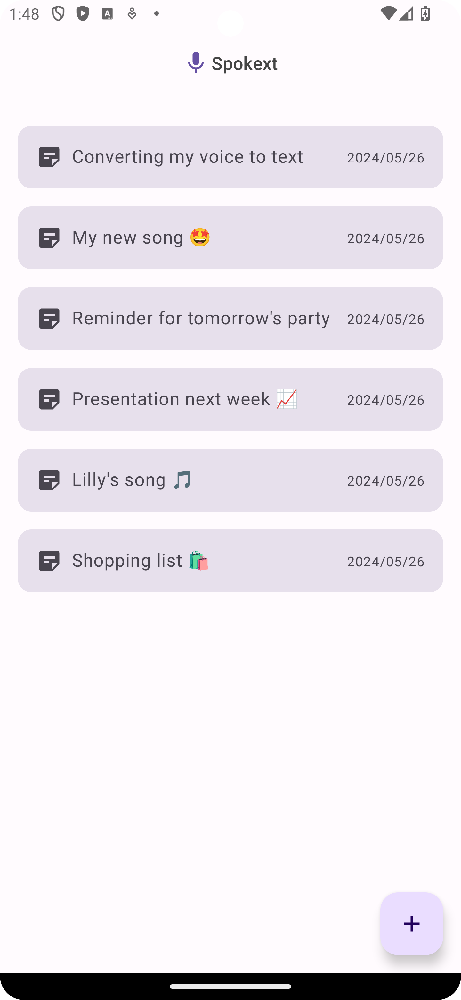
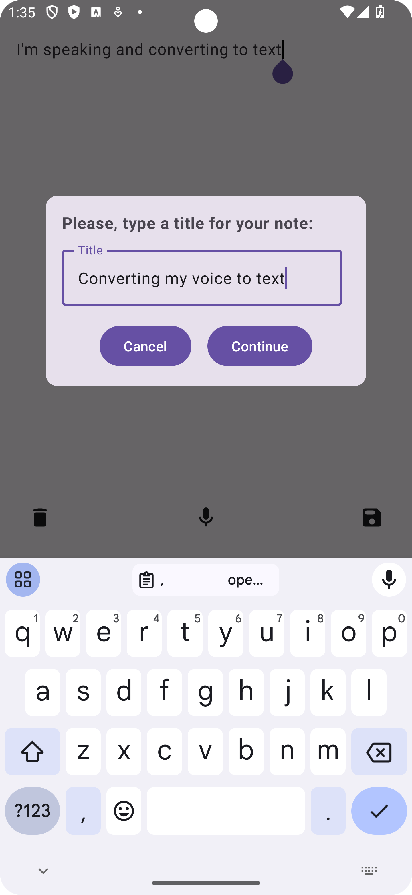
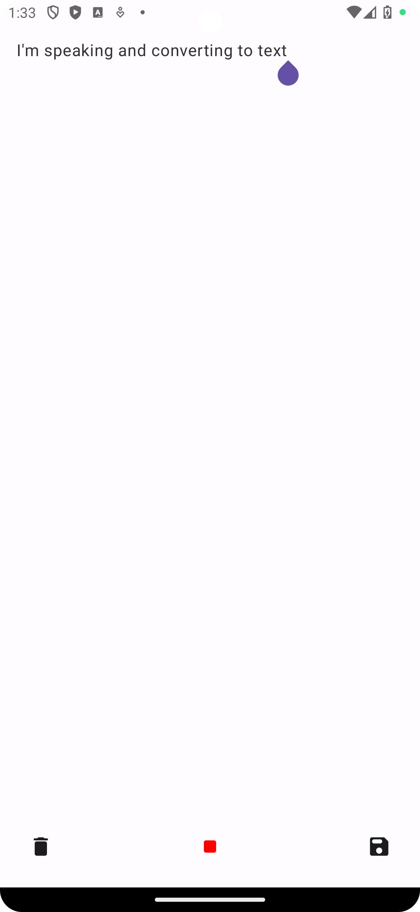
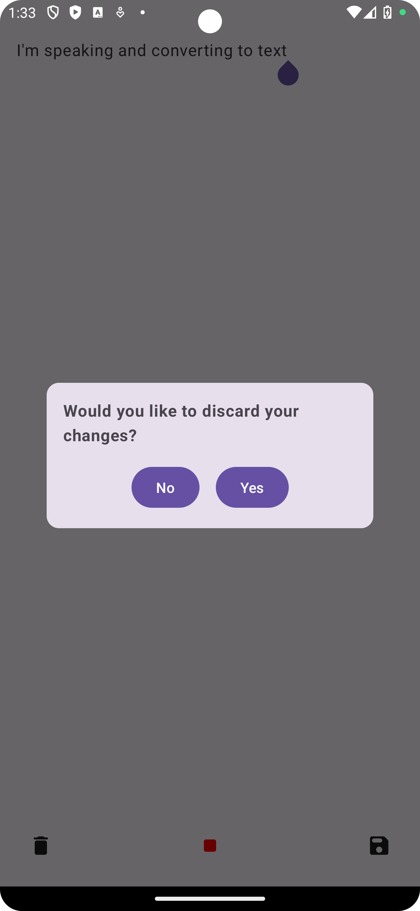
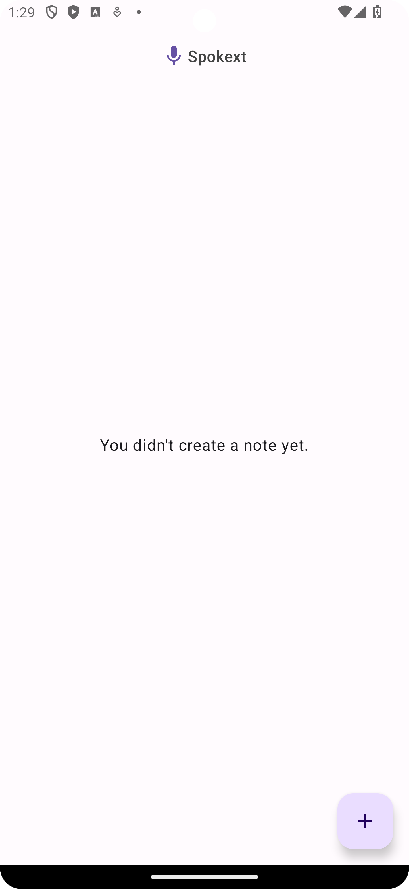
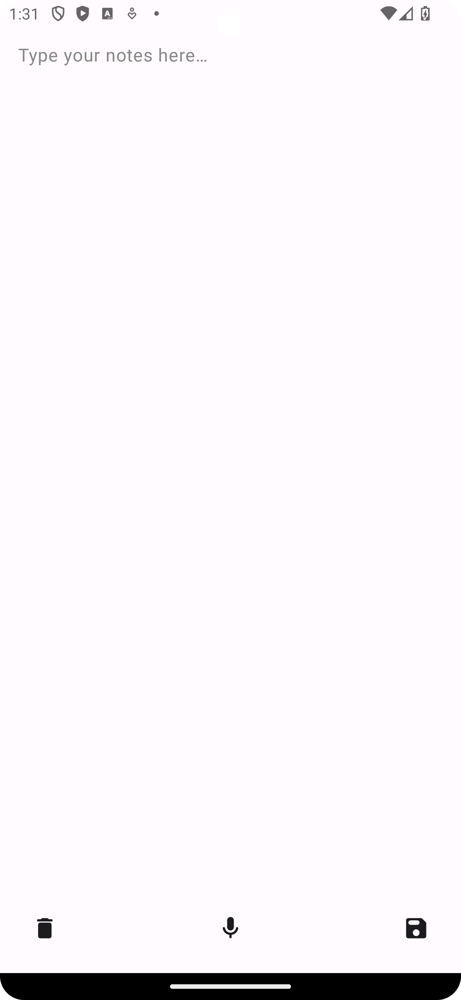

Spokext app
==================================

This app lets you create notes through the mic.

Speak and convert your voice to text.

It's developed using Jetpack Compose components.

    
  
  
  
  
  

Getting Started
---------------

1. [Install Android Studio](https://developer.android.com/studio/install.html), if you don't already
   have it.
2. Download the app.
3. Import the app into Android Studio.
4. Build and run the app.
